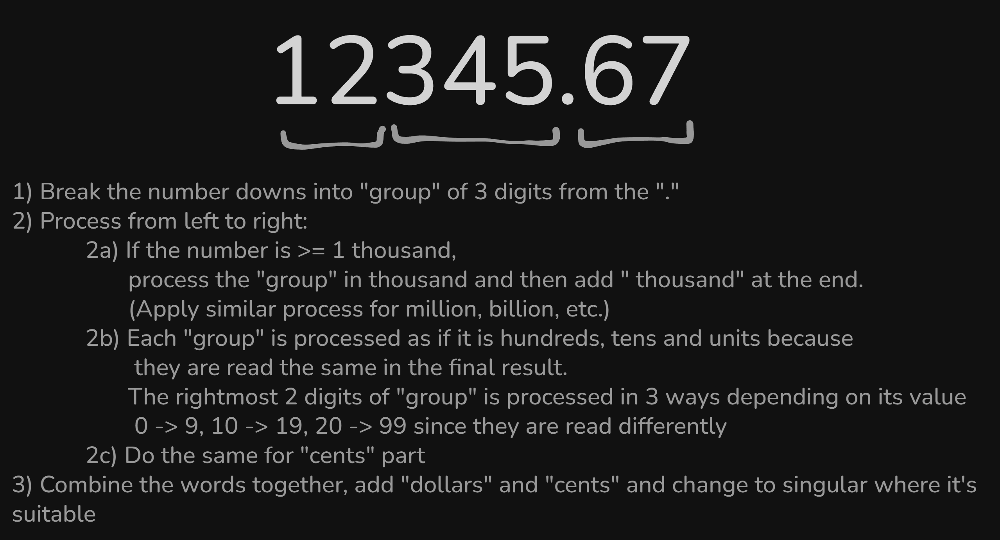

# Converter

Convert any monetary amount to words


## Getting started

```powershell
# This project is created from .NET MVC template
dotnet new mvc -o Converter
```

To run the server:

```powershell
dotnet restore
dotnet build
dotnet run
# dotnet watch  # for hot reloads in development
```

To run unit tests:
```powershell
dotnet test
```

## About the implementation 

Some of my decision and thinking when implementing this solution:
- Time complexity is O(n) - the algorithm is efficient even when dealing with large input
- Input is passed as `decimal` for easier processing, without an extra step of parsing
- Latest LTS version of .NET is used, making sure the codebase is up-to-date with latest features and securities
- API versioning (i.e. adding v1/ prefix to API route) was considered for future upgrades in case too many changes polute the original code but was not implemented as this is still a simple app and future features / enhancements are unclear.
- The convert logic in `ConvertService.cs` is written with expansion in mind (we may add EUR, VND, or NZD in the future). Therefore, the logic is broken down to simple steps and modular functions for reuse and better readability.
- The input is a currency amount so the file and function names also reflect and carry this business logic, making it easier to understand for Developers.  
- Only use "and" between the dollars and cents compared to the example, making the logic simpler without sacrificing any meaning.
- In test file `ConvertServiceTests.cs`, I use `string` input instead of number as InlineData perceives its input as `double` and lose the precision when passing to the tested function. In the body, the test then parse the `string` back to `decimal` to preserve precision.

## Design

#### User Stories
1. As a user, I want to receive converted words when sending a numerical string of a currency amount to the server.
2. As a user, I want a professional and accessible Web UI to interact with the server.
3. As a product owner, I want the algorithm to be efficient - reaching O(n) time complexity.

#### Technologies
- Frontend: React, TypeScript, Shadcn
- Backend: ASP.NET 8

#### User workflow


#### Number processing workflow


#### APIs

`GET /convert/{currencyAmount}`

#### Tests
- Apply Test-Driven Developement (TDD)
- Implement unit tests to cover all edge cases (0, negative, with or without cents, large number)
