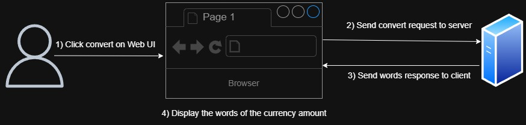

# Converter

Convert any money number to words

## Getting started

dotnet new mvc -o Converter

dotnet restore ??

dotnet buid

dotnet run # also build
dotnet run --watch ??

## About the implementation 

How you do it and why not the other ways?  
Time and space complexity, is it efficient?  
Make input and the data Front End sends number or decimal in .NET for easier processing 
Newest version of .NET is used for ...  
API version (i.e. adding v1/ prefix to API route) was considered for future upgrades in case too many changes polute the original code. But this was omitted since it is a simple app.  
Build the endpoint with expansion in mind: handle Euros, VND, NZD.  
The input is a currency amount so the filename and function names also reflect and carr this meaning. Make it easier to understand for Developers  

## Design

#### User Stories
1. As a user, I want to receive converted words when sending a numerical string of a currency amount to the server.
2. As a user, I want a professional and accessible Web UI to interact with the server.
3. As a product owner, I want the algorithm to be efficient - reaching O(n) time complexity.

#### Technologies
- Frontend: React, TypeScript, Shadcn
- Backend: ASP.NET 8

#### User workflow

#### APIs

GET /convert/{currencyAmount}

#### Tests
- Apply Test-Driven Developement (TDD)
- Implement unit tests to cover all edge cases (0, negative, with or without cents, large number)
